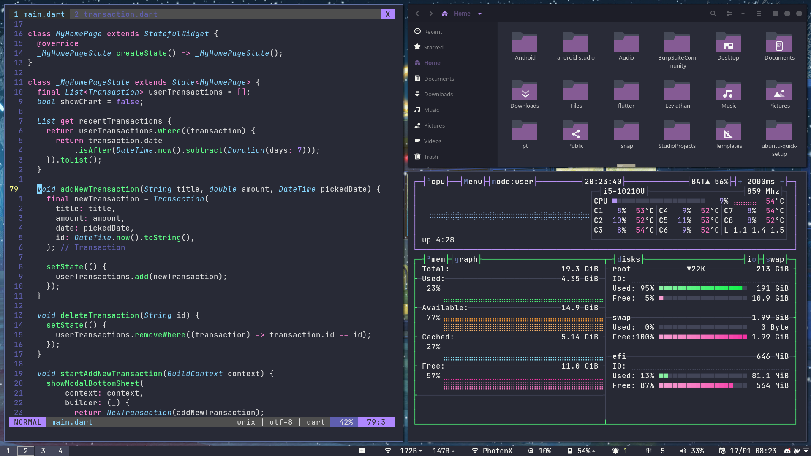
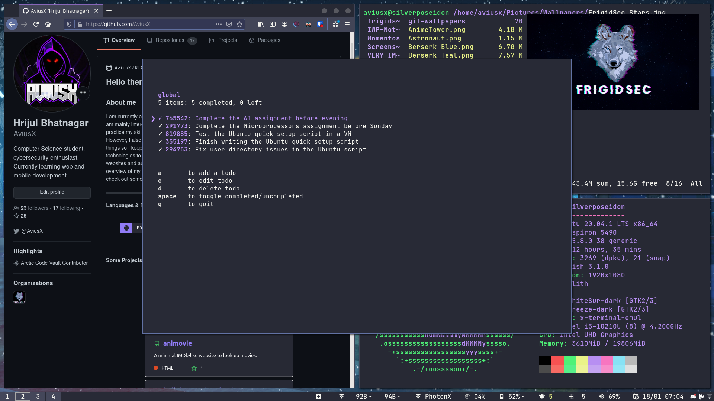

## Regolith Dracula

###### Description: Dotfiles from my Regolith i3 rice

---
<h3 align="center"> Screenshots </h3>
<p align="center">
       
       
</p>

<h3 align="center"> Installation </h3>


#### Install and configure tryone-picom
- Instructions to build and install tryone-picom [here](https://github.com/tryone144/picom/tree/feature/dual_kawase).
- Copy `./.config/picom.conf` to `~/.config/picom.conf`.


#### Commands to install themes and extensions-
```bash
sudo apt install -y regolith-look-dracula;
sudo apt install -y i3xrocks-wifi;
sudo apt install -y i3xrocks-todo;
sudo apt install -y i3xrocks-battery;
sudo apt install -y i3xrocks-bluetooth;
```

#### GTK theme and icon pack link
- Theme- [Dracula](https://draculatheme.com/gtk)
- Icons- [Zafiro Icons Purple](https://www.gnome-look.org/p/1209330/)

#### Font
JetBrains Mono

#### Customizing NeoVim
- Install vim-plug for neovim-
```bash
sh -c 'curl -fLo "${XDG_DATA_HOME:-$HOME/.local/share}"/nvim/site/autoload/plug.vim --create-dirs \
       https://raw.githubusercontent.com/junegunn/vim-plug/master/plug.vim'
```
- Open vim and run `PlugInstall`

#### Customizing Alacritty
Copy `./.config/alacritty` to `~/.config/alacritty` and copy `./.alacritty.yml` to `~/.alacritty.yml`
